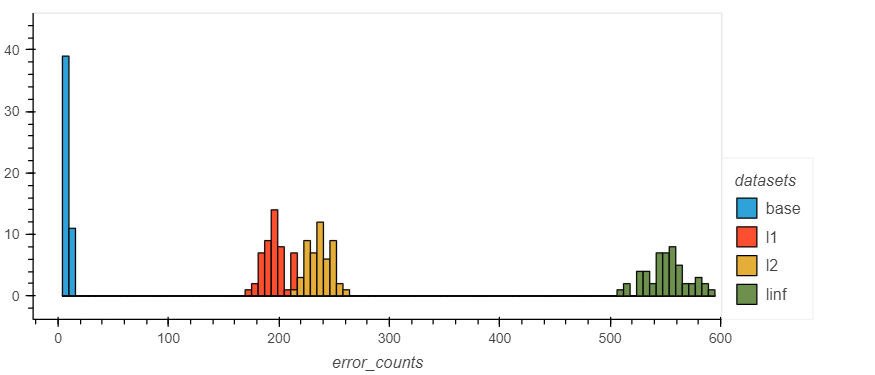

# Investigating the Robustness of Novel Deepfake Detection Transformer Models against Adversarial Attacks
A CS199 research project under the [University of the Philippines Computer Security Lab](https://csg.dcs.upd.edu.ph/home).

## Researchers
Hans Salazar ([@Hascion](https://github.com/Hascion))

Ieiaiel Sanceda ([@elsanceda](https://github.com/elsanceda))

Angelica Raborar ([@Anjellyrika](https://github.com/Anjellyrika))

## About the study
This repository contains scripts used to generate the results of a study on the robustness of novel deepfake detection transformer models against adversarial attacks.

We investigate two models, [SeqFakeFormer](https://arxiv.org/abs/2207.02204) by Rui Shao, Tianxing Wu, and Ziwei Liu, and [Deepfake vs real image detection ViT](https://huggingface.co/dima806/deepfake_vs_real_image_detection) by Dmytro Iakubovskyi. Please see the [SeqDeepFake](./seqdeepfake) and [Deepfake vs real image detection ViT](./huggingface_deepfake_vs_real_image_detection) folders for more details on our investigation of these models.

### Adversarial Attacks
We create three data sets of adversarial examples from the [deepfake and real images](https://www.kaggle.com/datasets/manjilkarki/deepfake-and-real-images) data set. Specifically, we apply the $L_1$, $L_2$, and $L_\infty$ norms of the [fast gradient sign method](https://arxiv.org/abs/1412.6572) with $\epsilon = 0.05$. The implementation of the fast gradient sign method in Python is sourced from v4.0.0 of the [CleverHans](https://github.com/cleverhans-lab/cleverhans/) library.

Please see the [Adversarial Attacks Evaluation](./adversarial_attacks_evaluation/) folder for our implementation of generating the adversarial data sets, and scripts for evaluating the performance of the Deepfake vs real image detection ViT on the examples.

## Summary of Results
We demonstrate that the performance of the chosen model Deepfake vs real image detection ViT changes significantly given the adversarial data sets, showing both a decline in accuracy and precision. The most significant change in performance is seen in the $L_\infty$ sample, with the model making an average of 551 prediction errors out of 1000 in 50 repeated experiments.

Our results suggest a need for more in-depth research into the architecture of transformer models and enhancements towards their resilience against adversarial attacks, to overall fortify the reliability of transformer-based deepfake detection systems.

*See the full paper [here](https://www.overleaf.com/read/yzfshpftbtdx#d62cf1).*
