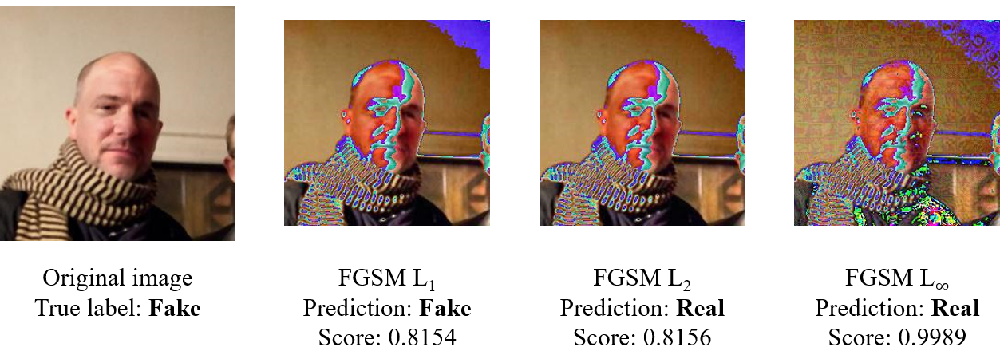

## Generating Adversarial Examples
We create three data sets of adversarial examples from the [deepfake and real images](https://www.kaggle.com/datasets/manjilkarki/deepfake-and-real-images) data set, based on the [OpenForensics: Multi-Face Forgery Detection And Segmentation In-The-Wild Dataset](https://zenodo.org/records/5528418#.YpdlS2hBzDd).

Specifically, we apply the $L_1$, $L_2$, and $L_\infty$ norms of the [fast gradient sign method](https://arxiv.org/abs/1412.6572) with $\epsilon = 0.05$. The implementation of the fast gradient sign method in Python is sourced from v4.0.0 of the [CleverHans](https://github.com/cleverhans-lab/cleverhans/) library.

See the [transformer attack notebook](transformer-attack.ipynb) for our implementation of creating and saving the adversarial examples.

An example of set of adversarial images is shown below:

## Evaluation
As an initial test, the Deepfake vs real image detection ViT was used to make predictions on each of the adversarial data sets. Predictions were recorded as well as the target predictions ("true labels") in .csv files: [fgsm_l1](fgsm_l1.csv), [fgsm_l2](fgsm_l2.csv), [fgsm_linf](fgsm_linf.csv).

Results are as follows:
|Attack|Accuracy|Correct predictions (out of 190335)|
|--|--|--|
|FGM $L_1$|0.99238|188886|
|FGM $L_2|0.98966|188367|
|FGM $L_\infty$|0.19796|37680|
