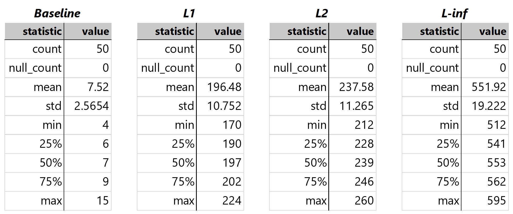

## Generating Adversarial Examples
We create three data sets of adversarial examples from the [deepfake and real images](https://www.kaggle.com/datasets/manjilkarki/deepfake-and-real-images) data set, based on the [OpenForensics: Multi-Face Forgery Detection And Segmentation In-The-Wild Dataset](https://zenodo.org/records/5528418#.YpdlS2hBzDd).

Specifically, we apply the $L_1$, $L_2$, and $L_\infty$ norms of the [fast gradient sign method](https://arxiv.org/abs/1412.6572) with $\epsilon = 0.05$. The implementation of the fast gradient sign method in Python is sourced from v4.0.0 of the [CleverHans](https://github.com/cleverhans-lab/cleverhans/) library.

See the [transformer attack notebook](transformer-attack.ipynb) for our implementation of creating and saving the adversarial examples.

An example of set of adversarial images is shown below:

## Evaluation
As an initial test, the Deepfake vs real image detection ViT was used to make predictions on each of the adversarial data sets. Predictions were recorded as well as the target predictions ("true labels") in .csv files: [fgsm_l1](fgsm_l1.csv), [fgsm_l2](fgsm_l2.csv), [fgsm_linf](fgsm_linf.csv).

Results are as follows:
|Attack|Accuracy|Correct predictions (out of 190335)|
|--|--|--|
|FGM $L_1$|0.99238|188886|
|FGM $L_2$|0.98966|188367|
|FGM $L_\infty$|0.19796|37680|

## Statistical analysis
A more rigorous experiment was conducted, in which the model was tested on 50 samples of 1000 images from each dataset. The number of prediction errors is then computed for each sample.

See the [analysis notebook](analysis.ipynb) for the implementation.

The number of errors made for each dataset ("baseline" meaning the original dataset) is described below:

The results are further visualized in the following histogram:

This visualization shows that the average amount of prediction errors made drastically increases depending on the applied norm of the FGM attack, with the worst performance being on $L_\infty$ with an average of 551 prediction errors out of 1000.
