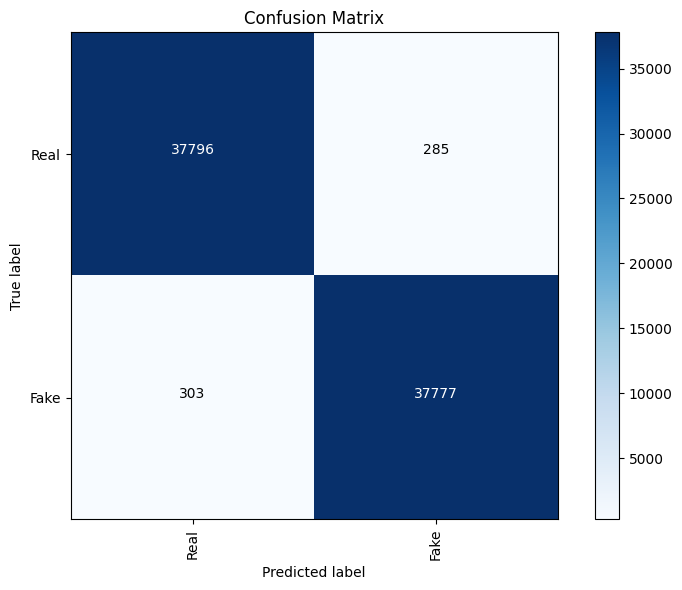
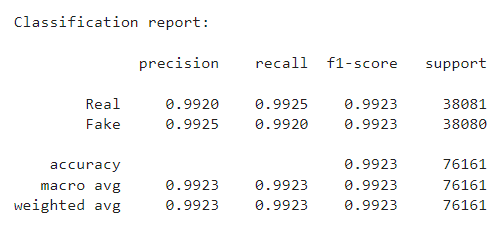

We investigate a transformer model sourced from Hugging Face, *Deepfake vs Real Image Detection*.

**Hugging Face**: [Deepfake vs Real Image Detection](https://huggingface.co/dima806/deepfake_vs_real_image_detection)  
**Kaggle Notebook**: [Deepfake vs real faces detection ViT](https://www.kaggle.com/code/dima806/deepfake-vs-real-faces-detection-vit)  
**Author**: Dmytro Iakubovskyi [(dima806)](https://www.kaggle.com/dima806/code)  

Please refer to the original notebook for detailed information on the model architecture and dataset preparation.

## Modifications
For our use of the model, some additional Python packages were installed. See the modified version [here](./HuggingFaceViT%20(Modified).ipynb), and the list of requirements [here](./requirements.txt).

## Initial Test Results
Testing the model yielded the following results (more details in the [HuggingFaceViT (Modified).ipynb](./HuggingFaceViT%20(Modified).ipynb)).

The precision on predicting the fake image class turned out slightly lower at 99.25\% than what was originally reported at 99.33\%. Overall, the model achieved an accuracy score of 99.23\%, with a very small difference of 0.04\% compared to the documented 99.27\%.

## License
The *Deepfake vs Real Image Detection* model is licensed under [Apache 2.0](https://huggingface.co/datasets/choosealicense/licenses/blob/main/markdown/apache-2.0.md).
